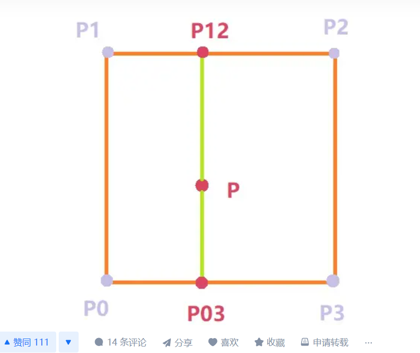

## https://gpuopen.com/learn/mesh_shaders/mesh_shaders-procedural_grass_rendering/

1. using bezier curve to represent blade of grass

2. 初始化数据，排列表，梯度表

建立采样空间。对于一维柏林噪声，采样空间为一个一维的坐标轴，轴上整数坐标位置均有一个点。而对应二维柏林噪声，采样空间为一个二维坐标系，坐标系中横纵坐标为整数的地方均有一点。三维柏林噪声同理。

