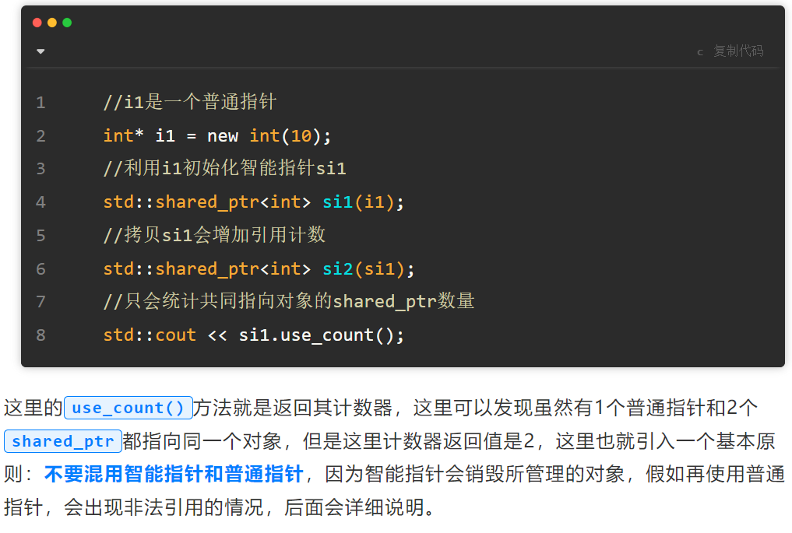

shared_ptr的实现原理是什么？构造函数、拷贝构造函数和赋值运算符怎么写？shared_ptr是不是线程安全的？
（1）shared_ptr是通过引用计数机制实现的，引用计数存储着有几个shared_ptr指向相同的对象，当引用计数下降至0时就会自动销毁这个对象；

（2）具体实现：

1）构造函数：将指针指向该对象，引用计数置为1；

2）拷贝构造函数：将指针指向该对象，引用计数++；

3）赋值运算符：=号左边的shared_ptr的引用计数-1，右边的shared_ptr的引用计数+1，如果左边的引用技术降为0，还要销毁shared_ptr指向对象，释放内存空间。

（3）shared_ptr的引用计数本身是安全且无锁的，但是它指向的对象的读

