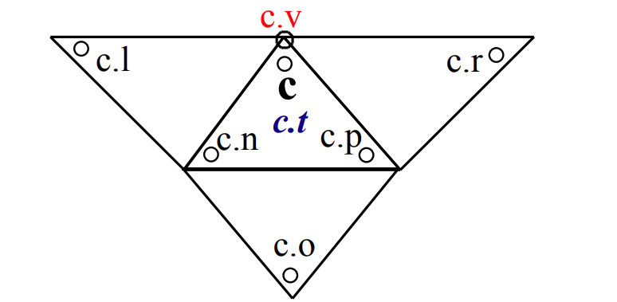
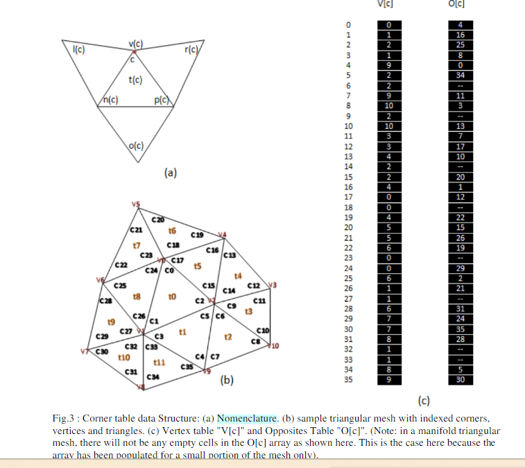

# 3D Compression Made Simple:Edgebreaker on a Corner-Table

## corner的示意图

论文中显示G数组，存储vertex的三维坐标信息

corner table中global table V,O 暂时性数组M，U

V存储该corner 对应的三维点的c.vertexindex, O 存储c.o

*每个三角形对应三个corner*，所以V，O，U都是三倍三角形个数大小，M的大小和vertex个数一致.M ,U 是访问数组，判断顶点，三角形是否被访问过

