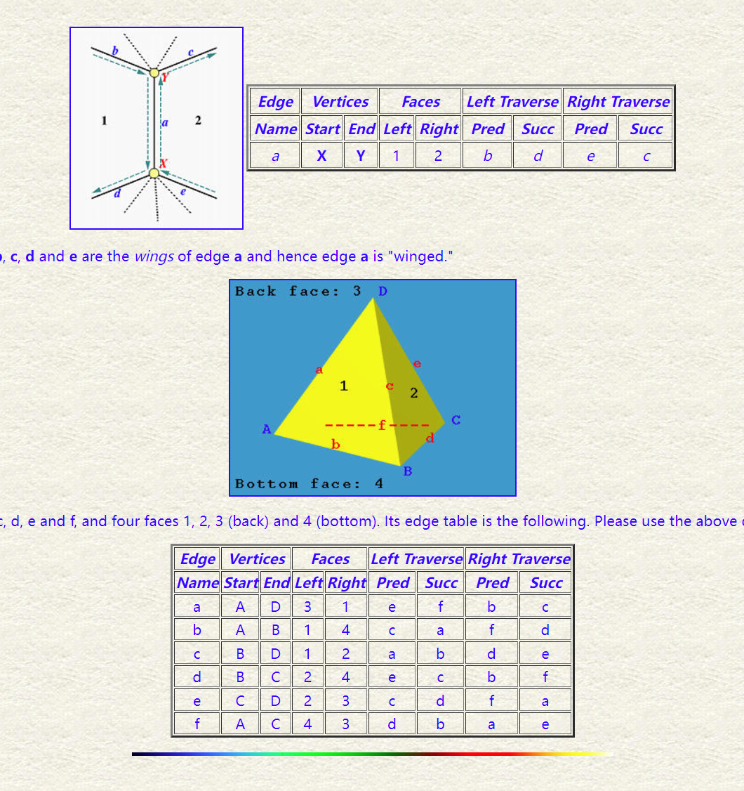

# winged-edge data structure

使用**edge**追踪具体模型的信息

    class Edge
    {
        Vertex *vert_origin, *vert_destination;
        Face *face_left, *face_right;
        Edge *edge_left_cw,
            *edge_left_ccw,
            *edge_right_cw,
            *edge_right_ccw;
    }

    class Vertex
    {
        float x, y, z;
        Edge *edge;
    }

    class Face
    {
        Edge *edge;
    }

相较于传统的mesh结构，（used on CG like obj file），当我们查询两个顶点的相邻关系时，我们需要遍历这个mesh的所有triangle的index才可以得出结论，如果使用上述结构，可以先查询vertex表，到边表继续查询。

如

    bool find_connect(Vertex* v1,Vertex* v2){
        Edge* start = v1->edge;
        Edge* searchedge = v1->edge;

        Vertex* temp = v1;
        do{
            if(searchedge->vertex_ori == v2 || searchedge->vertex_destination == v2)
                return true;
        //遍历含有该顶点的边
            if(searchedge->vertex_ori== v1)
                searchedge = edge_right_cw;
            else
                searchedge = edge_left_ccw;
        }
        while(searchedge!=start);
        return false;
    }
    

# half edged data structure

half edge的基本演示网站[url of half edge demo](https://jerryyin.info/geometry-processing-algorithms/half-edge/)

represent edge using a pair of directed half-edge twins

half edge 存储其对应twin的refence一个自身对应的三角形的两条边（winged edge 中存两个三角形，一个边对应一个边node）

## iterate around on a face
遍历一个面的的所有边

    start_he = f.halfedge
    he = start_he
    do {
        # do something useful

        he = he.next
    } while he != start_he

## iterate edge upon a vertex

    start_edge = v.edge
    edge = v.edge
    do{
        //do something
        edge = edge.prev.twin
    }
    while(edge!=start_edge)

