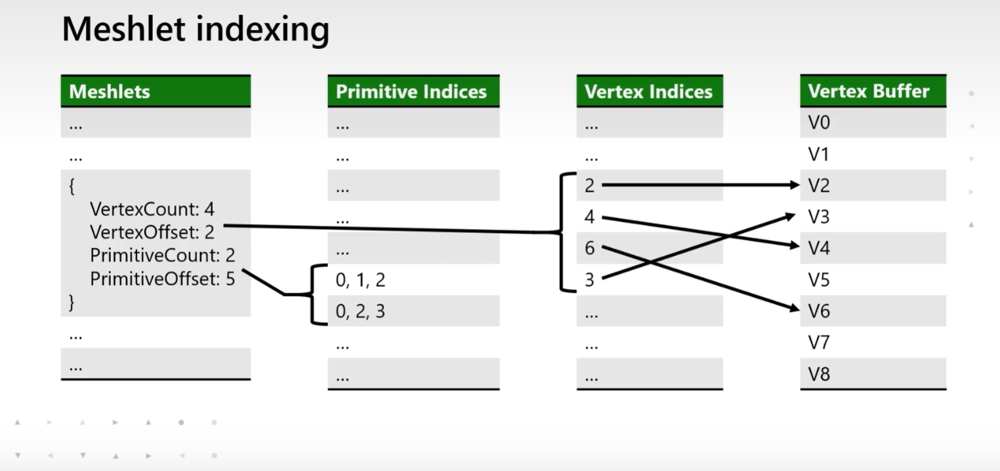

# 什么是direct3D 12

在微软的mesh shader介绍视频中，介绍了meshlet的组织方式，类似于论文中的双重索引结构 

index in meshlet(primitive) --> vertice index --> global geometry vertice

    uint packedindices=primitiveindices[meshlet.primitiveoffset+gtoupthreadid];

    outindices[groupthreadid]=uint3(packedindices&0xff,

    (packedindices>>8)&0xff,

    (packedindices>>16)&0xff);//将三个uint打包成为一个int并在meshshader中解压缩。

切线空间指的是三角形表面上面的一个局部空间
