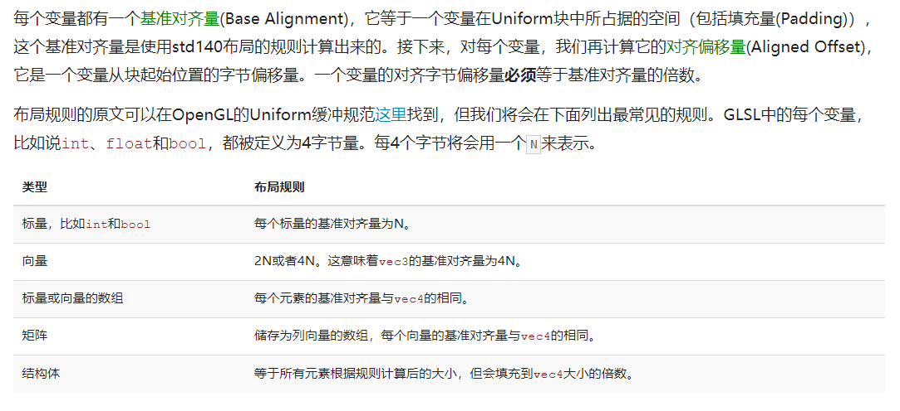
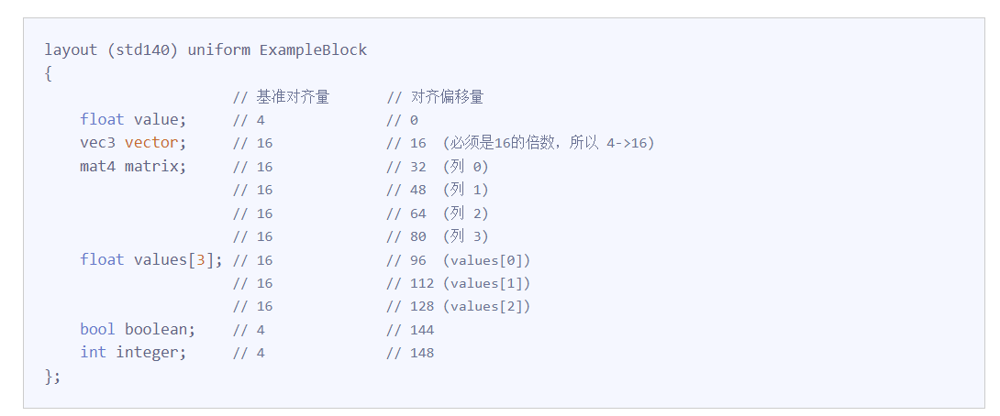
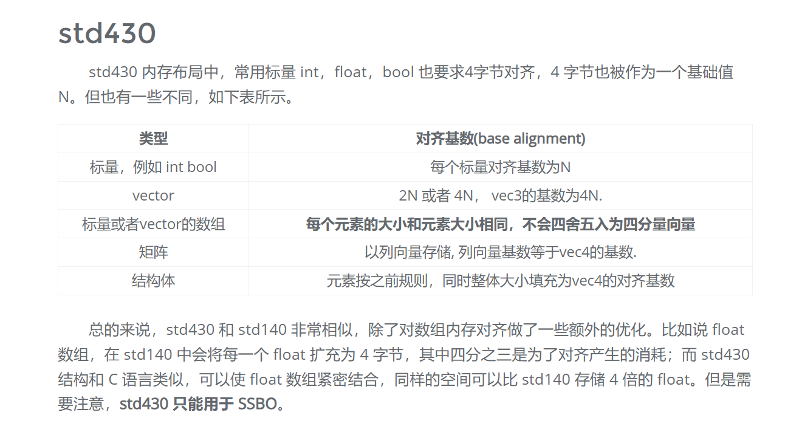

# SSBO

这块buffer用于向shader中直接传送数据，我在meshshader中需要使用ssbo来存储相应的全局index,geometry vertices等等

this is a simple ssbo tutorial

1. ssbo可以非常大 up to 128MB 
2. ssbo writable even atomically

## 用法-cpu
    int data[SOME_SIZE];
    ...
    GLuint ssbo;
    glGenBuffers(1, &ssbo);
    glBindBuffer(GL_SHADER_STORAGE_BUFFER, ssbo);
    glBufferData(GL_SHADER_STORAGE_BUFFER, sizeof(data), data​, GLenum usage); //sizeof(data) only works for statically sized C/C++ arrays.
    glBindBufferBase(GL_SHADER_STORAGE_BUFFER, 3, ssbo);
    glBindBuffer(GL_SHADER_STORAGE_BUFFER, 0);

## 用法 glsl

    layout(std430, binding = 3) buffer layoutName
    {
        int data_SSBO[];
    };

## C++ 的layout
1.  vec3占据12个字节

        struct test
        {
            char sdtgf;
            int a, b, c;
            char adsf;
        };  sizeof(test)占据20个字节

2. 对于c++ std::vector<struct>  struct 内部会有padding但是struct 与struct之间没有padding

## std140

这里有一个很坑爹的地方 ***float values[3]*** 每一个4字节的元素要占据vec4 --16字节的大小

vec3 等同于的 vec4。总之opnegl的布局 CPU --> GPU 这里的struct内部的布局本身就是需要尝试的

## std430

note: bool 占据4字节，vec3以及vec3[]都是4字节
int[]