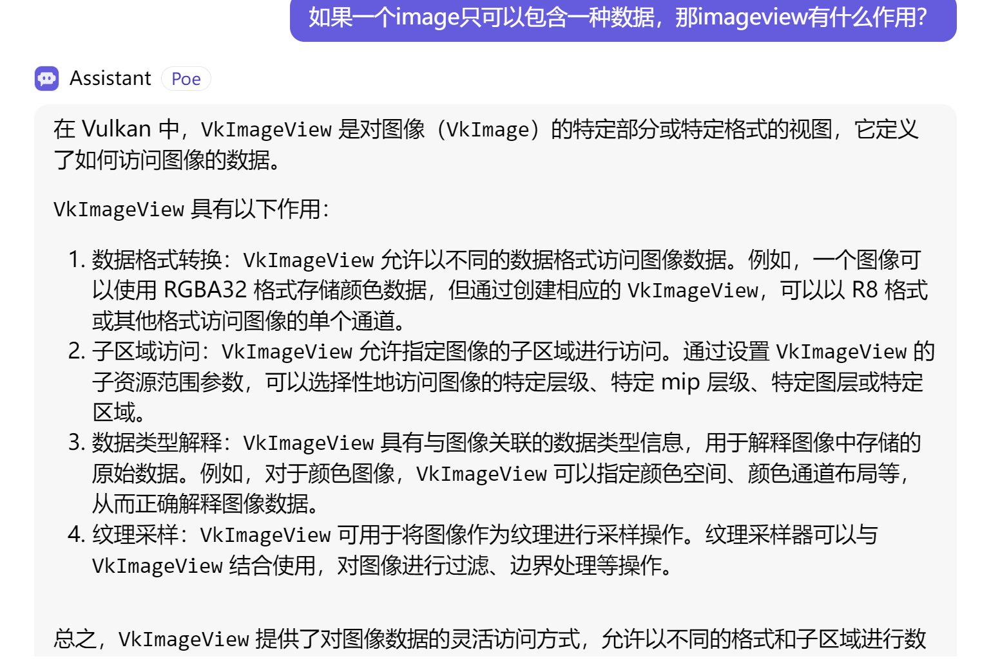

## vkshadermudule

a vkshadermodule 是一个processed shader file

create it from ***a precompiled spirV file***

## descriptor set

用直白的语言描述就是：在DescriptorSetLayout的指导下，利用Descriptor Pool提供的Descriptors，组装成一个符合DescriptorSetLayout的Set（即图中红色的DescriptorSet A）。

一个binding中间可以有多个descriptor set
