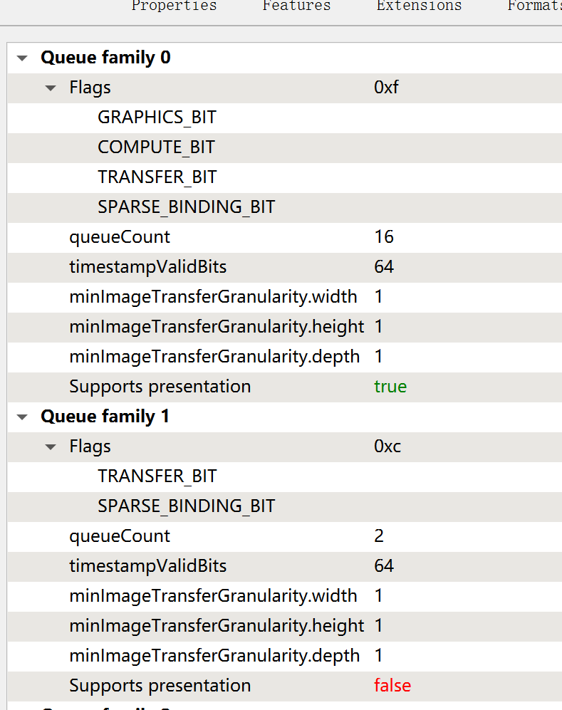
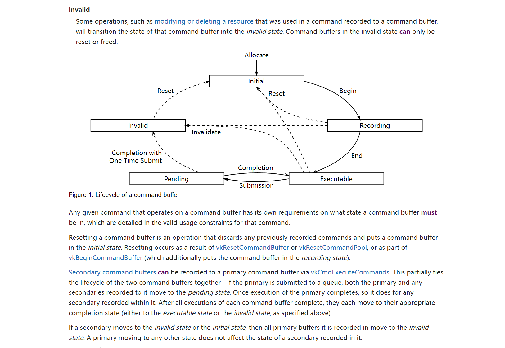
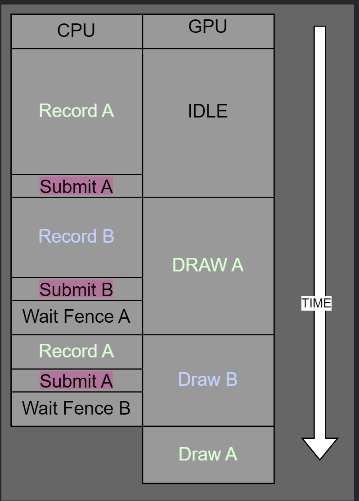

## window

一般来说有一个 window*成员变量在engine类中间，用glfw,sdl来和windows或者其他的操作系统交互

常用套路 

```cpp
_window = ***_create_window(name , width, height,***);
***_destroy_window(_window);

```
On every iteration of the inner loop, we do SDL_PollEvent. This will ask SDL for all of the events the OS has sent to the application during the last frame. 

是的，SDL_PollEvent 函数会从事件队列中获取事件并进行处理。事件队列是一个缓冲池，保存了应用程序接收到的各种事件，如键盘输入、鼠标移动、窗口事件等。


VK_PRESENT_MODE_IMMEDIATE_KHR Makes the swapchain not wait for anything, and accept instant pushing of images. This will likely result in tearing, generally not recommended.//立即刷新

VK_PRESENT_MODE_FIFO_KHR This will have a queue of images to present on refresh intervals. Once the queue is full the application will have to wait until the queue is popped by displaying the image. This is the “strong VSync” present mode, and it will lock your application to the FPS of your screen.//垂直同步，并且不撕裂

VK_PRESENT_MODE_FIFO_RELAXED_KHR . Mostly the same as Fifo VSync, but the VSync is adaptive. If the FPS of your application are lower than the optimal FPS of the screen, it will push the images immediately, likely resulting in tearing. For example, if your screen is a 60 HZ screen, and you are rendering at 55 HZ, this will not drop to the next vsync interval, making your general FPS drop to 30 like Fifo does, instead it will just display the images as still 55 FPS, but with tearing.//高于帧数问题不大，低于的话就会撕裂，

VK_PRESENT_MODE_MAILBOX_KHR . This one has a list of images, and while one of them is being displayed by the screen, you will be continuously rendering to the others in the list. Whenever it’s time to display an image, it will select the most recent one. This is the one you use if you want Triple-buffering without hard vsync.


Unlike OpenGL or DirectX pre-11, in Vulkan, all GPU commands have to go through a command buffer, and executed through a Queue.

//gpu 端的命令都必须先过cmdbuffer然后再由queue执行

It is possible to submit the same command buffer multiple times. In tutorials and samples it’s very common to record the commands once, and then submit them every frame in the render loop. In this tutorial, we are going to record the commands every frame, as it’s more relevant to how a real render engine works.

//tutorial中buffer可以只填充一次，但是real engine因为object不停变化所以要每一帧提交

// cost opeartor is queue submit
Recording commands in Vulkan is relatively cheap. Often, the operation that is costly is the VkQueueSubmit call, where the driver validates the command buffer and executes it on the GPU.
//驱动需要验证commandbuffer并执行

// cmd buffer可以并行录制
// record different cmd buffer from different threads

// n vk cmd pool n threads
// n cmd buffer n threads


## Queue
// key VKqueue submit不是线程安全的，一次只可以一个thread提交

// queue 是gpu的执行端口
 Every GPU has multiple queues available, and you can even use them at the same time to execute different command streams.



队列家族（queue family）和队列（queue）对应于显卡的不同硬件组件和功能。

队列家族是显卡中的逻辑概念，用于表示一组具有相似功能和性能特征的命令队列。每个队列家族可以有一个或多个队列，这些队列可以并行执行命令。队列家族通常由显卡驱动程序提供，并与硬件功能和特性相关联。

队列（queue）则是显卡中实际的硬件组件，用于管理和执行命令。每个队列都有自己的状态和执行上下文，可以独立地接收和执行命令。队列负责将命令发送到显卡的渲染管道或计算单元，并确保正确的执行顺序和同步。

A VkCommandPool is created from the VkDevice, and you need the index of the queue family this command pool will create commands from.

cmdbuffer在提交后和执行完前都是alive的，因此最好要2个buffer
这是因为命令缓冲的执行是异步的。当调用vkQueueSubmit提交命令缓冲时，命令缓冲会被添加到队列中，并进入GPU的命令执行队列。但是，GPU的命令执行是在后台进行的，不受CPU控制。因此，在命令缓冲提交后，并不能立即确定GPU何时完成执行。



https://registry.khronos.org/vulkan/specs/1.2-extensions/html/chap6.html#commandbuffers-lifecycle

With Vulkan structures, it is very important that we do this

    VkCommandPoolCreateInfo commandPoolInfo = {};
By doing that ` = {}` thing, we are letting the compiler initialize the entire struct to zero. This is critical, as in general Vulkan structs will have their defaults set in a way that 0 is relatively safe. By doing that, we make sure we don’t leave uninitialized data in the struct.



## vkfence  CPU GPU端通信
    //we have a fence object created from somewhere
    VkFence myFence;

    //start some operation on the GPU
    VkSomeOperation(whatever, myFence);

    // block the CPU until the GPU operation finishes
    VkWaitForFences(myFence);
    //fences always have to be reset before they can be used again
    VkResetFences(myFence);

## vksemaphore GPU GPU端通信

    VkSemaphore Task1Semaphore;
    VkSemaphore Task2Semaphore;

    VkOperationInfo OpAlphaInfo;
    // Operation Alpha will signal the semaphore 1
    OpAlphaInfo.signalSemaphore = Task1Semaphore;

    VkDoSomething(OpAlphaInfo);

    VkOperationInfo OpBetaInfo;

    // Operation Beta signals semaphore 2, and waits on semaphore 1
    OpBetaInfo.signalSemaphore = Task2Semaphore;
    OpBetaInfo.waitSemaphore = Task1Semaphore;

    VkDoSomething(OpBetaInfo);

    VkOperationInfo OpGammaInfo;
    //Operation gamma waits on semaphore 2
    OpGammaInfo.waitSemaphore = Task2Semaphore;

    VkDoSomething(OpGammaInfo);