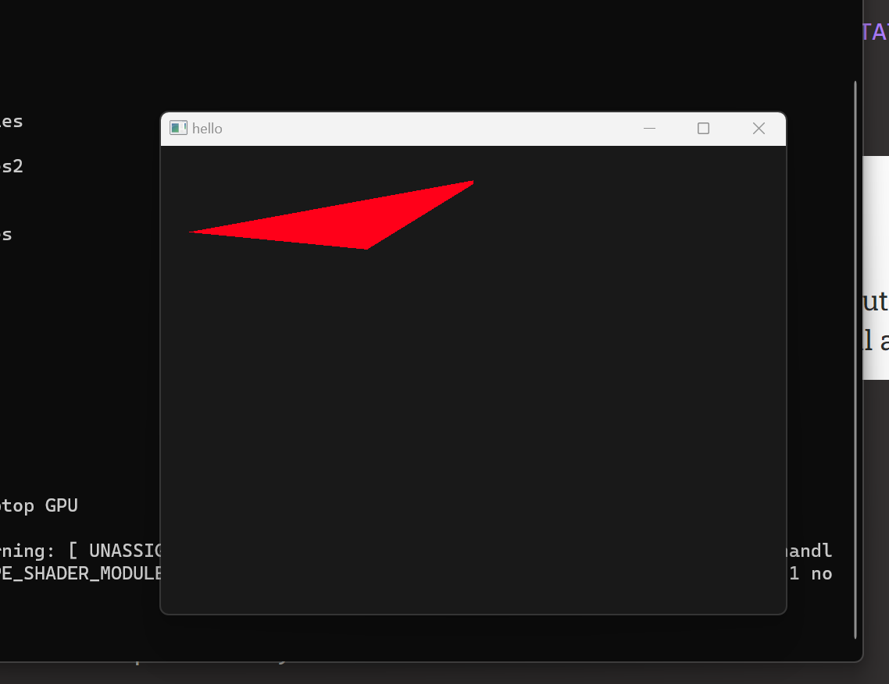
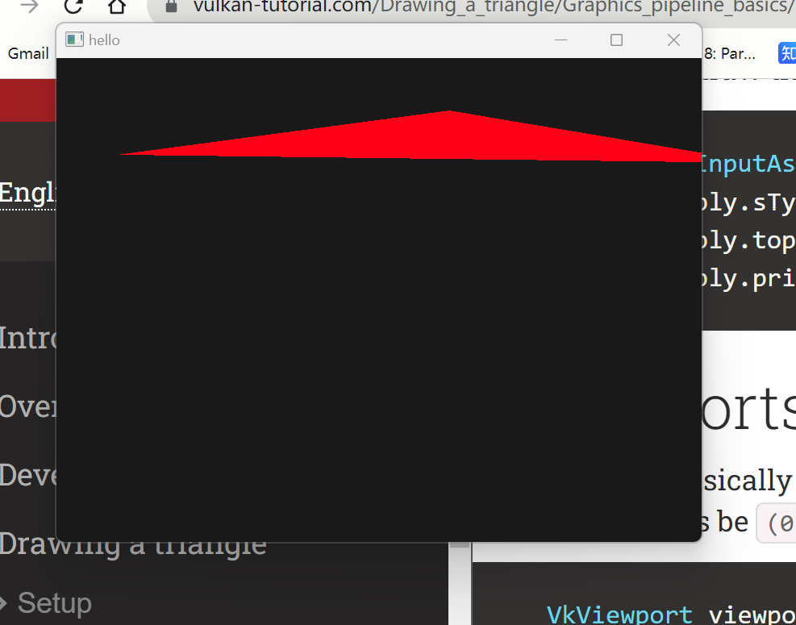

# 渲染管线

## input assembly

我的理解是把各个buffer的图元组装成一块一块送给vertex shader

## vertex shader

处理每一个vertex，使用变换矩阵，将可见的物体裁剪的 [-1，-1，0,---- 1,1,1]的空间里面去

## primitive assembly and resterization

根据EBO 和制定好的图元类型组装，裁剪三角形，去除规范空间外的图元，

对于三角形来说

    void Resterization(v1 ,v2 ,v3){

        turn v1,v2,v3 into 800*600 space(framebuffer space)

        calculateBOX(left,right,high,low);
        for(left --> right)
            for(low --> high)
                if(isPixelinTRI)
                    if(calDepthbuffer <  Depbuffer[pixel location])
                        calculateInterpolateValue();
                        StoreAsPixelInput
    }

## frag shader
use input calculate color per pixel

## vulkan空间坐标

左到右 -1 --> 1

下到上 1-->-1(与OpenGL相反)

## shader module
            fileop                                wrap                 
    spvfile ----> std::vector<char> shaderbyte --------> shader module  ---------> vkpipelineshaderstage

我们需要把这个shader module装填到 pipeline中间去,从单纯的byte stream wrapper to specific shader stage

## dynamic state

viewport scissor

如果在vkpipelinedynamicstatecreateinfo中间指定了他们，则不需要初始化，而是要在draw的时候指定

将viewport调小，同时还可以设置起始位置

viewport指定framebuffer中哪一块区域会被渲染

viewport指定了image --> framebuffer的transformation  在 clip && rasterization之前配置，我认为viewport是光栅化的第一步 从-1，1空间映射到指定viewport

scissor指定哪个区域的pixel会被存储并送至fragmentshader,指定结束这两个就可以送至光栅化了

    normal_coord.xy ---> viewport_coord.xy  (offset && width , height)
    for each pixel : square of triangle
        if(pixel[i,j] in scissor && pixel in triangle && ( optional face culling ) ){
            record pixel[i,j].attribute{
                fragpos;
                color;
                depth;
            }
        }

如果是固定的viewport 和 scissor则需要指定vkpipelineviewportstatecreateinfo{viewport scissor}

## commandpool 
每一个command pool只可以allocate commandbuffer （这个command buffer只可以提交同一种类型的queue） 所以command pool需要指定queuefamily

## gpu asynchronous

    VkCommandBuffer A, B = ... // record command buffers
    VkSemaphore S = ... // create a semaphore

    // enqueue A, signal S when done - starts executing immediately
    vkQueueSubmit(work: A, signal: S, wait: None)

    // enqueue B, wait on S to start
    vkQueueSubmit(work: B, signal: None, wait: S)

这些命令在CPU 中都是立刻执行的，他的异步控制都是在GPU内部实现的