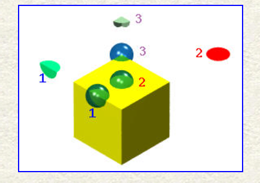
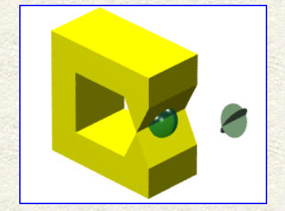
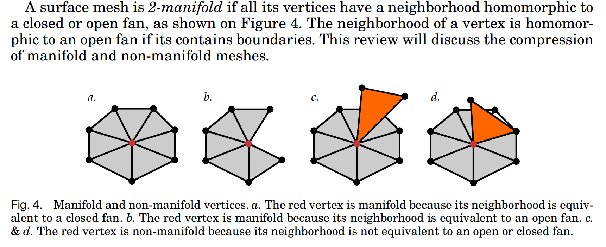

# manifold定义

在数学中，流形（英语：manifold）是可以“局部欧几里得空间化”的一个拓扑空间，即在此拓扑空间中，每个点附近“局部类似于欧氏空间”。更精确地说，n维流形（n-manifold），简称n流形，是一个拓扑空间，其性质是每个点都有一个邻域，该邻域同胚于n维欧氏空间的一个开集。

## 2流形的定义

对于表面上任意的一个点，可以选取一个半径足够小的球包裹，截取其相交面，并且可以把他deform(twist or bend) 成为一个disk并且没有cutting and gluing 

# 上图解析

b图红色点为1-流形，非边界点为2流形

c图红色点为非流形