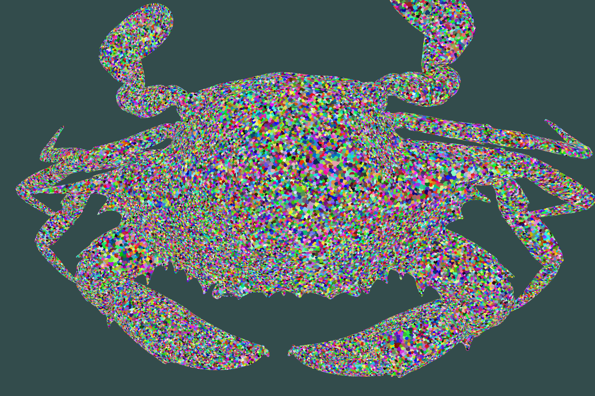
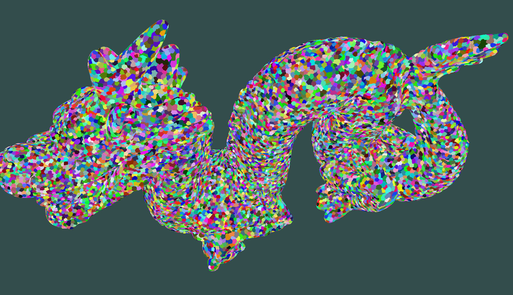
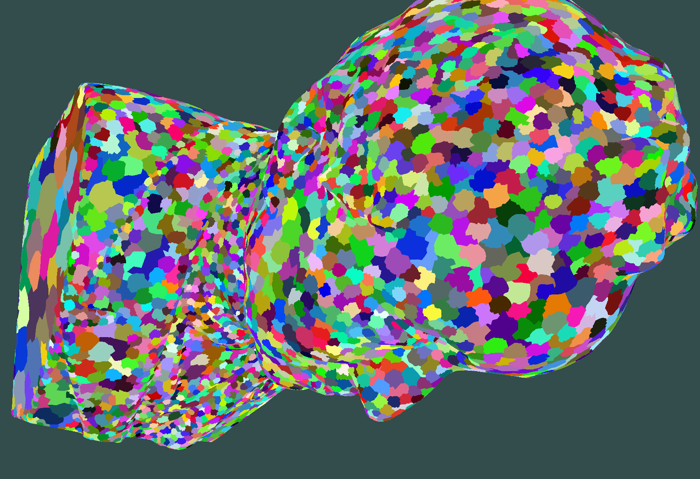
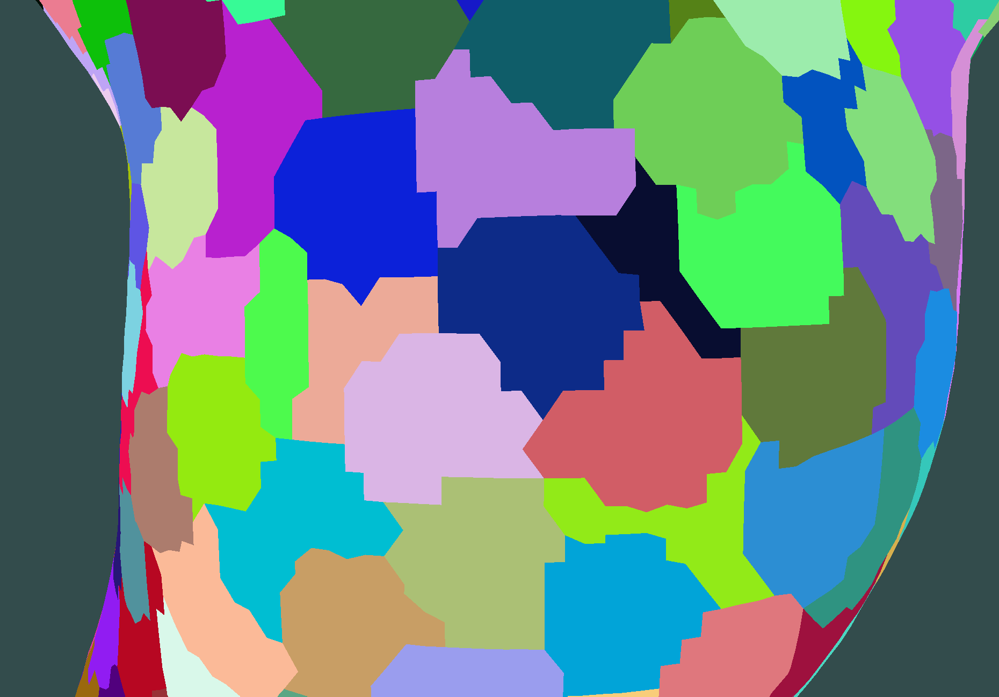
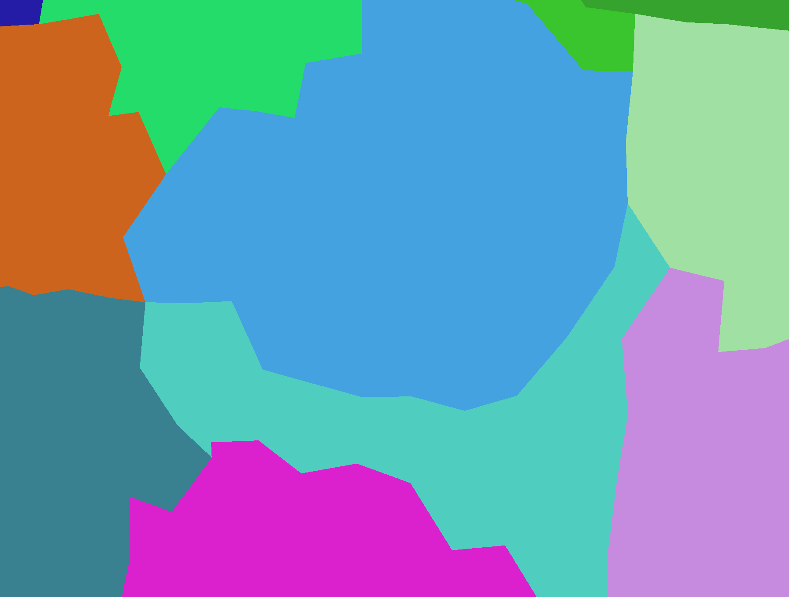
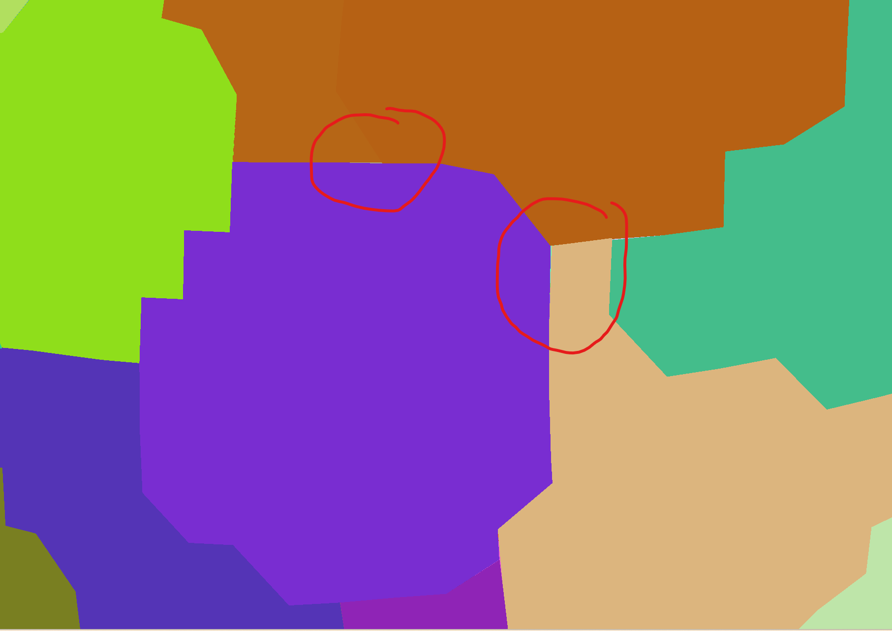
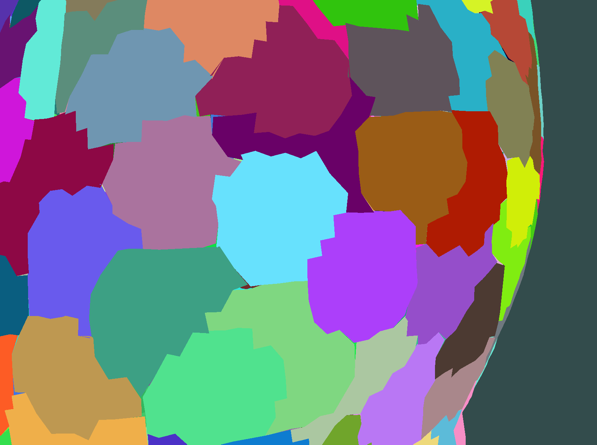
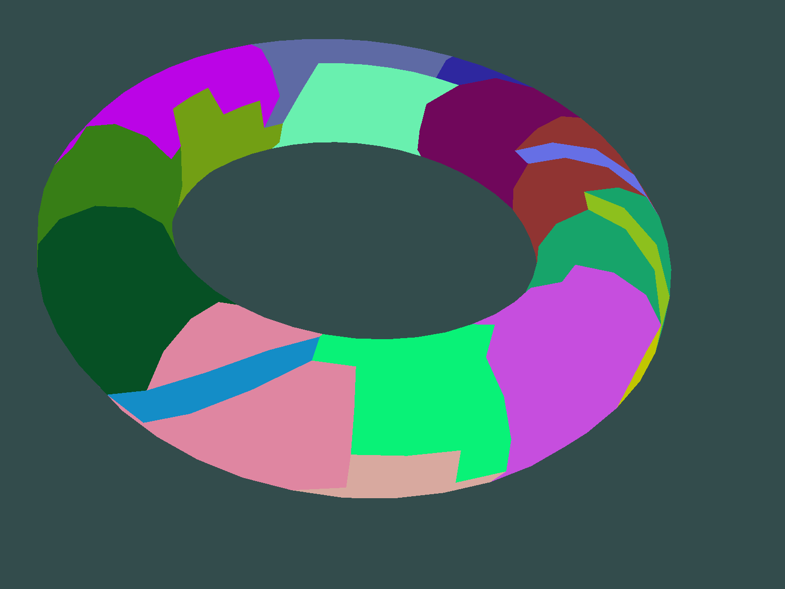

## mesh 分割优化

### 评价mesh分割好坏的标准
统计所有meshlet的Eshape和Efit

如果该shape接近于一个圆盘，则Eshape为0

    Eshape = boundlength*boundlength / (4 * PI * area) - 1;

Eit是所有点到拟合平面的距离加和除以该meshlet的特征长度，这里我选取的是boundlength/4, 在乘以一个10

    Efit = 40 * sum(distance(point,fitplane)) / boundlength

### 模拟退火算法实现

1. 记录好每一个meshlet当前的 area , boundlength , positions(Eigen::vector3d) , Energy (shape+fit+num)

2. 随机选一个三角形，直至该三角形是边界三角形，然后一半概率选择移除该三角形，或者加入一个周边三角形

3. 计算移除或者加入之后 两个meshlet的energy总和

    	float Eshape =( (length * length) / (4 * PI * area) - 1);
        float Efit = 40*FitsquareEnergy(positions, normal, center)/positions.size() /length;
        float Enum = std::max((float(positions.size()) - maxv+2), 0.0f);

        return Eshape+ Efit + Enum;

4. 对比两个meshlet的前后能量综合 根据如下代码决定是否状态转移

		float cmpvalue = 1.0;
		if ((newadjenergy + newmidenergy) < Rawenergy)
			cmpvalue = 1.0;
		else
			cmpvalue = std::exp((Rawenergy - newadjenergy - newmidenergy) / (Rawenergy*decreaserate));

		if (dis(gen) < cmpvalue) {
            //执行状态转移；
            }
        else{
            //do nothing
            }

### 算法后处理

1. 处理分裂的meshlet，meshlet不是单连通的则要分割

2. 处理顶点个数超过限制的meshlet
    先尝试移除 2-boundtris 若达不成对应的要求则分割meshlet以符合maxv maxf

### 算法流程

	EvaluateMeshlet(mesh);
    std::cout << "优化前meshlet数量：" << mymeshlets.size() << std::endl;

    //优化 
	DeleteSmallMesh(mesh); //删除小型meshlet
	FirstDeleteMesh(mesh); //绕meshlet边缘减去毛刺
	SimulateAnneal(mesh,0.5,0.01,500); //模拟退火
	RegularBigMeshlet(mesh); //规范化优化的meshlet

	EvaluateMeshlet(mesh);
	std::cout << "优化后meshlet数量：" << mymeshlets.size() << std::endl;

其中模拟退火的终止能量设为0.5，下降率设为0.01，终止循环数设为500

### 效果

|模型|三角形|初始meshlet数量 | 初始Eshape + Efit |优化后meshlet|优化后Energy|
|---|---|---|---|---|---|
|armadillo| 212k|3295|3945+1003|2758|3085+948|
|head| 500k| 7210|6071+1278|5929|5036+1302|
|Dragon_1|2.3m|32760|22493+8516|27371|19064+8144|
|crab|11.3m|160250|133484+18592|136891|114564+18994|

### 划分结果
可以看出来这些meshlet的划分shape都近似于一个一个小圆盘，这是由于Eshape决定的。但是值得注意的是这些小型meshlet的边缘并不是光滑的会有一些小突起，但是较为尖锐的毛刺基本没了

## 裂缝修复对比
再高精度下的corner处会有非常细小的crack，提高vertex bit generation时的error tolerance可以使得裂缝变大

使用全局坐标的corner

局部corner坐标，精度为 boundingbox first image * 0.0001
second image * 0.001

### 拓扑验证

sphere 
torus 因为不允许环状mesh

                
