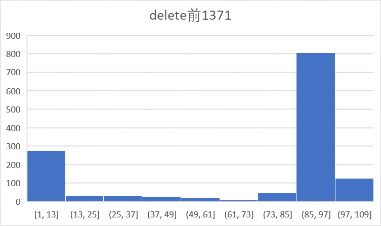
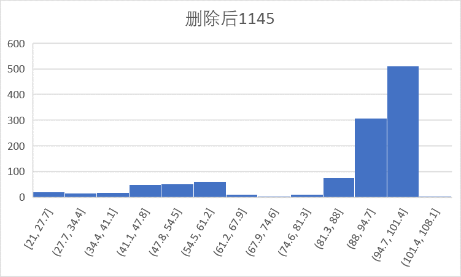
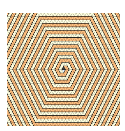
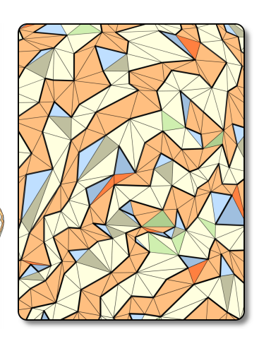

## meshlet小型分割至相邻meshlet

在将meshlet拓扑规则化之前delete small mesh。

先sort然后将 **vertexnum < maxvertexnum/3** 的对应的meshlet片插入到周围的meshlet中间

遍历三角形，选取边界三角形:

1. 可以直接插入，相邻的node依然满足对应maxv,maxt条件
2. 插入后不满足，遍历被插入的node,找 一个三角形（两条边都是边界边）插入相邻的node。如果找不到，则分割该被插入的meshlet为两块。

主要问题：当想要做一个递归试的插入时，发现取一个或者两个边界三角形不一定可以减少该顶点的vertex set数量，并且单边界边的三角形被去除之后可以node就会被分割了。检测一个node是否联通计算量不小。递归可能时指数增长的，去除一个顶点可能要去除多个三角形。

结果 on horse.obj：

## gpu解压缩渲染

12个参数 rotatx rotaty rotaty transx transy tranz
scalex scaley scalez xnum ynum znum
解压缩这些数据需要一个全局的translation_box（记录meshlet最大最小xyz坐标） scale_box（记录meshlet最大最小的scale range）

我在设置压缩顶点的精度的时候没有采取全局精度，而按照 **（translationbox.max - translationbox.min)* rate(0.0001)与xyz三个坐标偏差值做比较**

***平均xnum ynum znum 2.2158 3.65405 4.08123(horse.obj)***

edge wire会共享corner point,即为一个corner point会有两个local coordianate解压缩来会有一定的裂缝，论文里面将这个corner point使用一个全局的coordinate压缩。这个我还没有做

遇到最坑的问题是构建旋转矩阵的时候，glsl是列主序的。直接赋值构造的旋转矩阵和我想得不一样。

## topu解压缩
论文里面是 2+6 = 8bit记录connect信息，通过这2bit信息避免重复渲染T2三角形，并减少irregular三角形数目
但是我观察到可以直接使用6bit,然后重复渲染T2三角形。并且跑多的demo没有出现超过maxprim的情况。

## 可以做的
1. opengl迁移到vulkan或者directx12。很多的glsldebug工具无法在opengl上面work,然后直接不支持opengl mesh shader扩展。
rendoc 1.30支持了vulkan direct12 ultimate的mesh shader 调试。**要进一步继续在mesh shader上面做工作最好换一套API。**

2. task shader。 **back face culling,occlusion culling,view frustum culling都没有做** 其中occlusion culling效率最好写起来最复杂
可以参考ninate 层次Zbuffer

3. 一个新的connect解压缩方法
Lace ring会生成一个哈密更环，

我们可以以条带为拓扑形状进行分割，只需要记录条带左边和右边的在该哈密更环的起始点和长度。几何数据可以统一保存

解压缩的时候把 边在一侧，但是边对应顶点不在另一侧的corner三角形根据其corner point并行解压出，并将其去除出条带，最后就剩下一个规则拓扑的条带。

条带解压缩是根据当前边对应的另一侧的顶点的index解压缩，这个index也可以通过计算一遍前缀和（使用更少的bit）得到。

