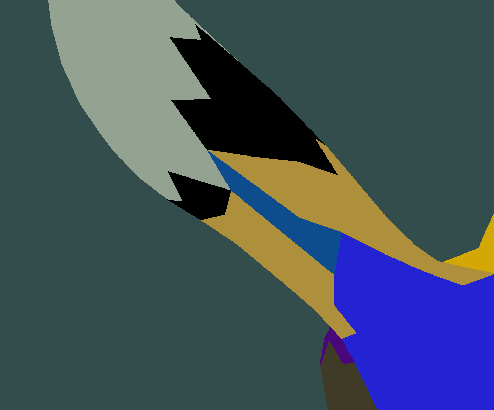

##
思考：
因为有一个simalate anneal了，我在complex insert的时候是否还要将vertex过多的meshlet进行撕裂？

First delete mesh再 simulate anneal之前似乎没有什么存在必要了

Todo:

1. 怎么处理多个方形meshlet中间压缩导致的条状不规整meshlet

2. DDG 我想把mesh规整划分成为一个 都是四node相邻的拓扑结构的meshlet 似乎可以做single mesh several lod什么的
做法 一个 球体同胚的mesh curvature flow 至一个球在做划分？或者可能的参数化曲面？

3. topu检验

    1. 初始化和delete small meshlet只需要考虑插入即可，插入node之后会不会形成环

    2. simulate anneal 插入的是否成为环，去除的是否成为两段

    3. 在使用模拟退火时可能会出现meshlet的face个数归零的情况，怎么说，可以不考虑出去是否破坏？

## 初次生成的效果
在第一轮cluster做一个禁止生成环的条件，结果不是很理想。。和后处理结果类似

