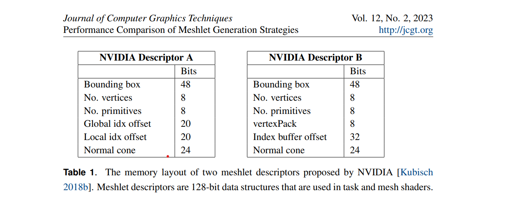
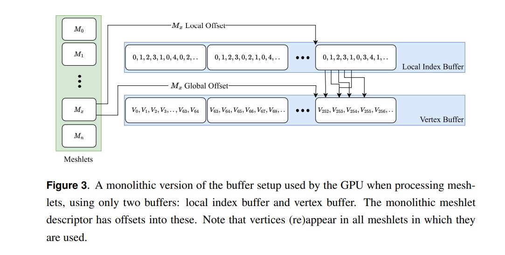
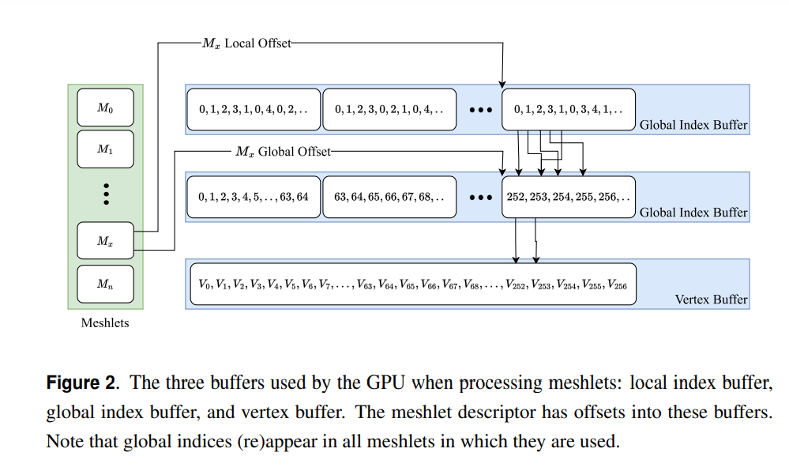
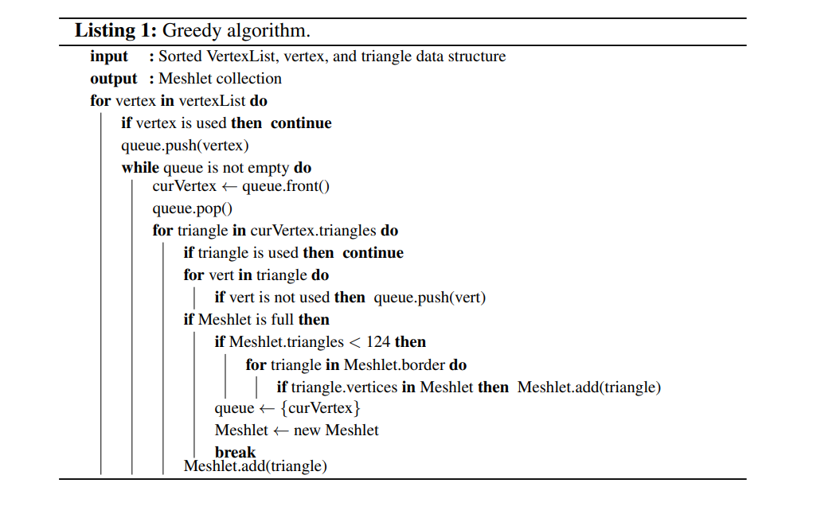

## 思考 self contain meshlet
local index buffer
self contain vertex buffer
如果pack到一起会怎么样

## different ways

1. zeux mesh optimizter

构建方式1.record connect info,kd tree 
one for vertex reuse one for min area

2. greedy function
deque方式，从vertex周围所有的三角形的insert方式

## conclusion
We find, quite simply, that, on the NVIDIA hardware, meshlet collections that minimize the number of meshlets and maximize the triangles in each meshlet perform best.
Meshlets have vertex and primitive limits; in this paper we used the suggested 64 vertices and 126 triangles