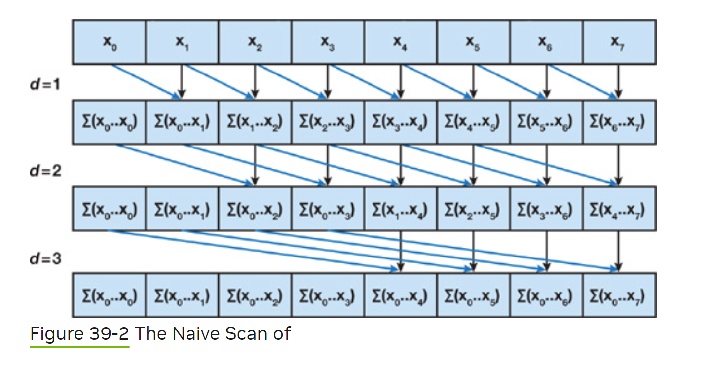
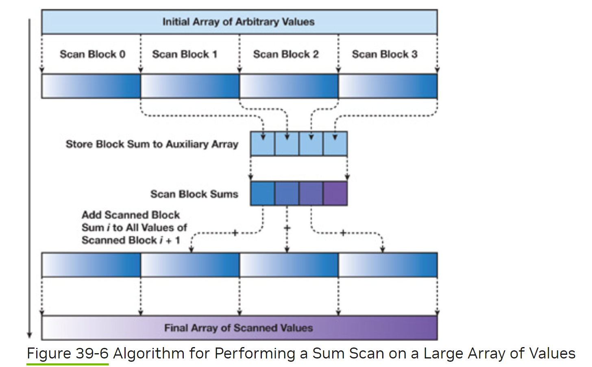

##  前缀和算法实现

https://developer.nvidia.com/gpugems/gpugems3/part-vi-gpu-computing/chapter-39-parallel-prefix-sum-scan-cuda

### 要求计算 all prefix sums
//在我的应用场景里面，线程数为32，所以这个naive实现很好，但是对于大型的数组，不是所有数组元素都是可以和线程一一对应的，多以把nums按照wrap的大小进行分割是比较好的新的算法

    [3 1 7 0 4 1 6 3]

    would return

    [0 3 4 11 11 15 16 22].
    
    for level = 1: logn do
        for all k in parallel do 
            if k>= 2^level then
                s[k] = s[k] + s[k-2^level]
            end
        end
    end
    //naive implementation of prefix sum        

这个算法适合小数组

适合大型数组

### cuda基本概念

Grid（网格）：Grid是一个由多个线程块（blocks）组成的二维结构。在CUDA编程中，Grid是由线程块的X和Y维度组成的矩阵。Grid的大小取决于应用程序的需求和GPU的硬件限制。

Block（线程块）：Block是一组线程的集合，这些线程在GPU上被分配并行执行。在CUDA程序中，开发者可以指定每个线程块的维度和大小。线程块内的线程可以通过共享内存进行通信和协作。

Thread（线程）：Thread是CUDA中最小的并行执行单元。GPU上的每个线程都可以执行相同的指令，但是可以使用不同的线程ID来访问不同的数据或执行不同的分支逻辑。

dim是维度长度，blockIdx是idx

    int main() {
        // ...
        int *d_array; // GPU上的数组
        int N = 1000; // 数组大小

        // 分配GPU内存
        cudaMalloc((void**)&d_array, N * sizeof(int));

        // 启动kernel函数
        int blockSize = 256;
        int numBlocks = (N + blockSize - 1) / blockSize;
        myKernel<<<numBlocks, blockSize>>>(d_array, N);

        // 处理完后释放GPU内存
        cudaFree(d_array);

        return 0;
    }

    __global__ void myKernel(int *array, int N) {
        int index = blockIdx.x * blockDim.x + threadIdx.x;
        if (index < N) {
            array[index] *= 2;
        }
    }

## Crack free memory layout

	Desloc --> DesInfo --> interwire --> intercon intergeo
						|
					   --> exterwire --> corneridx
									|
									--> extercon extergeo		

	//DesInfo Memory Layout
	struct CornerMeshletDes {
		uchar ewirenum;
		uchar color[3];

		uchar irrnum;
		uchar numvertex;
		uchar numinver;
		uchar ingeostart;

		std::vector<uchar> numexver;//need pack

		uint interwireloc;
		std::vector<uint> exterwireloc;
	};

	//interWire mem layout
	2* vertexnum*8 
	irrnum*3*8
	96 解压缩数据
	vertexnum * pntlength

	//exterWire mem layout 
	wirebitflow 首先是两个corner vertex index 32*2位
	然后是 evertexnum*2*8 bit的con infomation
	vertex data: (evertexnum - 2)* pntlength